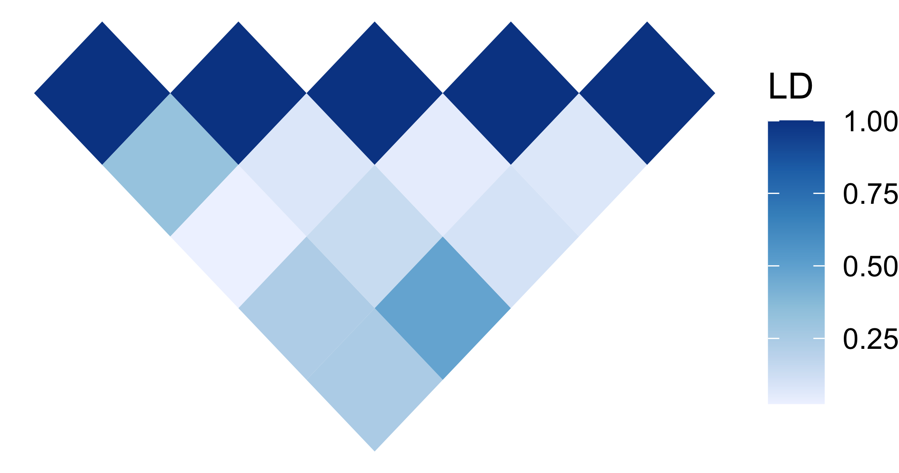

# ggLD
An R package to visualize a correlation matrix (e.g. LD matrix) using ggplot2 and the diagonal on the x-axis. The package as it is can visualize more than 1,000 features (e.g. SNPs) fast. 

## Installation
```r
devtools::install_github("mmkim1210/ggLD")
```

## Example
```r
# Load relevant packages
library(tidyverse)
library(ggLD)

# ggplot2
ggLD(data = abs(cor(data.frame(a = rnorm(20), 
                               b = rnorm(20), 
                               c = rnorm(20),
                               d = rnorm(20),
                               e = rnorm(20)))))
```

